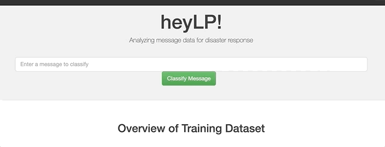

# Disaster Response Classifier

A web application that simulates the classification of texts into categories during a disaster which can be of a great addition to organizations and companies helping those in need during a disaster.

#### Getting Started:

##### Required Libraries:

Apart from the libraries included in the Anaconda distribution for Python 3.6, following two libraries are included in the project.
1) nltk
2) sqlalchemy

##### Data

Data was downloaded from the [Figure8](https://appen.com/)

##### Installing 
 To clone this git repo:
 
 git clone https://github.com/sujanshahi050/Disaster-Response-Classifier.git

##### Running the Web App

Run the following commands to get the app running:
1) To run ETL pipeline that cleans data and stores in database
        `python data/process_data.py data/disaster_messages.csv data/disaster_categories.csv data/DisasterResponse.db`

2) To run ML pipeline that trains classifier and saves
        `python models/train_classifier.py data/DisasterResponse.db models/classifier.pkl`

##### Authors

Sujan Shahi

##### Acknowledgements

Udacity and Figure8

##### License
[MIT LICENSE] https://opensource.org/licenses/MIT

